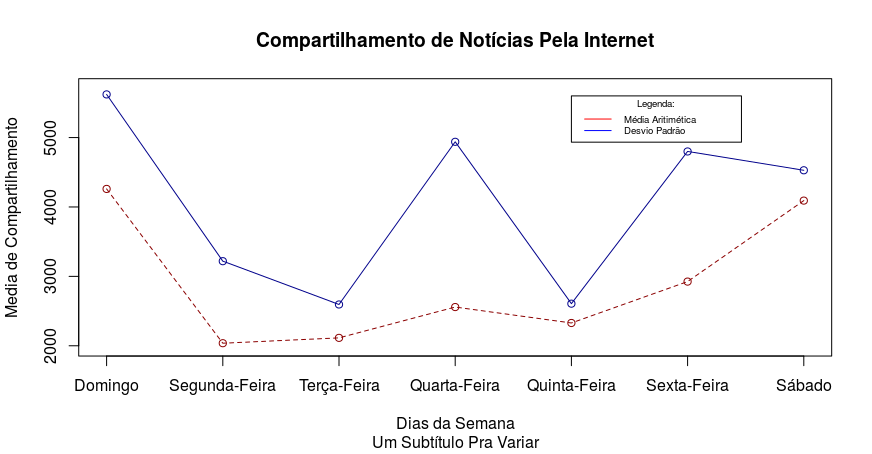

# Tarefa

> Prazo final para a tarefa - 10/10/2017 (terça-feira) 

Para esta tarefa utilizaremos o <i>dataset</i> [<i>Online News Popularity Data Set</i>](https://archive.ics.uci.edu/ml/datasets/Online+News+Popularity). Pela descrição, se trata de um conjunto heterogêneo de recursos sobre artigos publicados pelo portal <i>Mashable</i> em um período de dois anos.

Vários atributos compõem o <i>dataset</i>, alguns deles são:
<ul>
  <li>Taxa de palavras positivas (global_rate_positive_words);</li>
  <li>Quantidade de palavras no título do artigo (n_tokens_title);</li>
  <li>Subjetividade do texto do artigo (global_subjectivity);</li>
  <li>Dia da semana em que o artigo foi publicado (weekday_is_'dia');</li>
  <li>Quantidade de compartilhamento nas redes sociais (shares).</li>
</ul>

Baixe o <i>dataset</i> para o mesmo diretório do seu script R e use a função <code>read.csv()</code> do R para fazer a leitura.

## Primeira questão

Filtre os dados e faça uma lista contendo as médias das quantidades de compartilhamento (shares) de cada dia da semana (domingo à sábado), algo como:

<code>medias <- c(media_das_segundas, media_das_tercas,...)</code> 

E depois, plote um <b>gráfico de linha</b> usando a função <code>plot</code> contendo as linhas referênte a média e desvio padrão. Orientações:
<ul>  
  <li>Complemente o gráfico com título, subtítulo e labels dos eixos X e Y;</li>
  <li>Defina um limite customizado para o eixo Y;</li>
  <li>Legenda;</li>
  <li>O gráfico deve ter como axis (labels escalares do eixo X) cada dia da semana;</li>
  <li>Linha do tipo traçado e cor customizada;</li>
  <li>Complemente a linha com ponto.</li>    
</ul>

Ao final, o gráfico deve estar similar a este:

## Segunda questão

Usando o mesmo <i>dataset</i> faça novamente duas listas com as taxas de palavras positivas (global_rate_positive_words) e negativas (global_rate_negative_words) de cada dia da semana. exemplo:

<code>taxa_positiva <- c(media_da_taxa_positiva_das_segundas, media_da_taxa_positiva_das_tercas,...)</code> 
<code>taxa_negativa <- c(media_da_taxa_negativa_das_segundas, media_da_taxa_negativa_das_segundas,...)</code> 

Adapte o gráfico contextualizado de acordo com as orientações da questão anterior, menos o limite do eixo (este deve ser parametrizado de acordo com os dados nas listas).
Além das taxas positivas e negativas, existe no <i>dataset</i>, as taxas de palavras positivas entre <i>tokens</i> não neutros (rate_positive_words) e as taxas de palavras negativas (rate_negative_words) entre <i>tokens</i> não neutros. Faça outro gráfico da mesma forma que o anterior desta questão e monte um <i>grid</i> com os dois gráficos, ou seja uma imagem com duas colunas contendo os dois gráficos.

## Extra

Será um extra retirar outra qualquer informação do dataset e plotar. Usem a imaginação.

### Para o commit

Faça o Pull Request com apenas a pasta com seu nome contendo o(s) script(s) com extensão ".R" e as imagens plotadas em formato ".png".